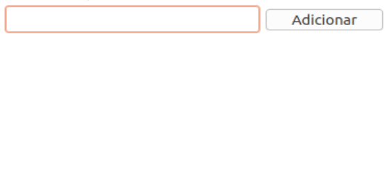

Tecnologia em Análise e Desenvolvimento de Sistemas

Setor de Educação Profissional e Tecnológica - SEPT

Universidade Federal do Paraná - UFPR

---

*DS122 - Desenvolvimento de Aplicações Web 1*

Prof. Alexander Robert Kutzke

- [Instruções para submissão de tarefas e trabalhos](https://gitlab.tadsufpr.net.br/ds122-alexkutzke/material/blob/master/instrucoes_submissao_tarefas_e_trabalhos.md);
- [Video aula](https://www.youtube.com/watch?v=d6ZTnQNhoCo)

# Manipulação de HTML com DOM

Crie uma página web com o seguinte comportamento:

Ou seja, uma página com uma caixa de texto e um botão. Ao clicar no botão, o conteúdo da caixa de texto é adicionado como um novo item de uma lista exibida logo abaixo.
