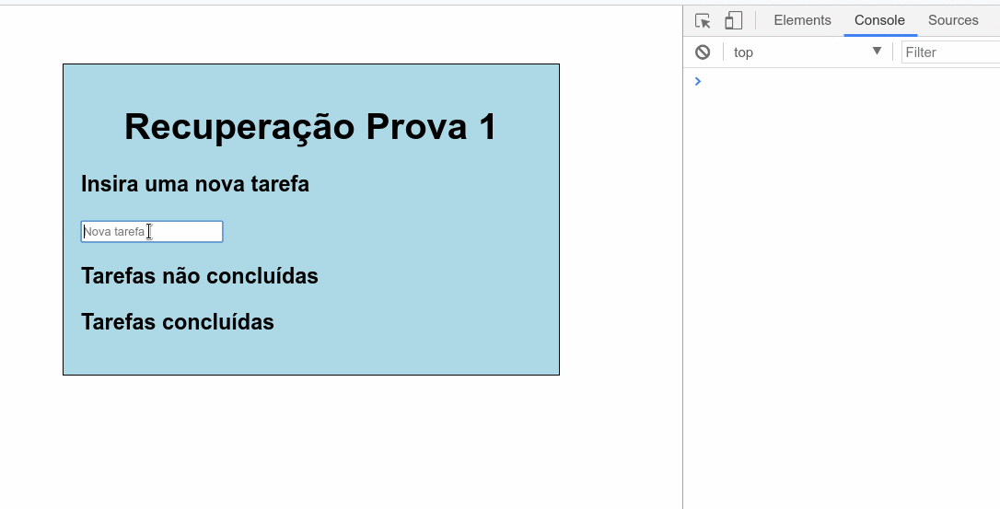

Tecnologia em Análise e Desenvolvimento de Sistemas

Setor de Educação Profissional e Tecnológica - SEPT

Universidade Federal do Paraná - UFPR

---

*DS122 - Desenvolvimento Web 1*

Prof. Alexander Robert Kutzke

* [Instruções para submissão de tarefas e trabalhos](https://gitlab.tadsufpr.net.br/ds122-alexkutzke/material/blob/master/instrucoes_submissao_tarefas_e_trabalhos.md)
* [Video aula](https://www.youtube.com/watch?v=d6ZTnQNhoCo)

# Atividade Jquery 

Crie a seguinte página WEB utilizando recursos de HTML, CSS e JS (Jquery é permitido):

> Um pequeno sistema de lista de tarefas: a página é composta por um campo de texto
> onde o usuário digita uma nova tarefa. Após pressionar ENTER (adicione um botão de submit, se preferir), esse texto se torna
> uma tarefa e é exibido em uma listagem na própria página de "tarefas não concluídas". Ao clicar em uma
> tarefa criada, ela se torna "concluída" e deve ser
> enviada para uma outra lista, de "tarefas concluídas". É importante que, durante
> todo o funcionamento, as tarefas concluídas e não concluídas estejam armazenadas em 
> dois arrays JS.

Exemplo:

Obs.: os arquivos HTML, CSS e JS devem estar separados.
